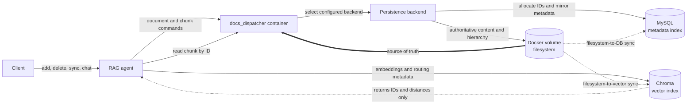
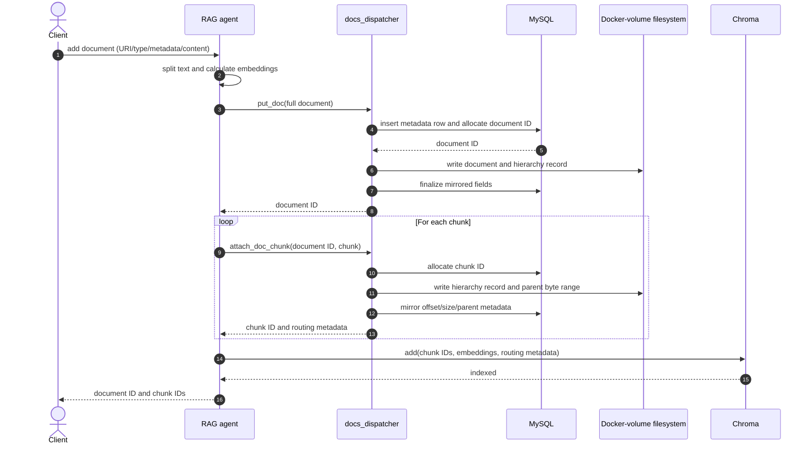
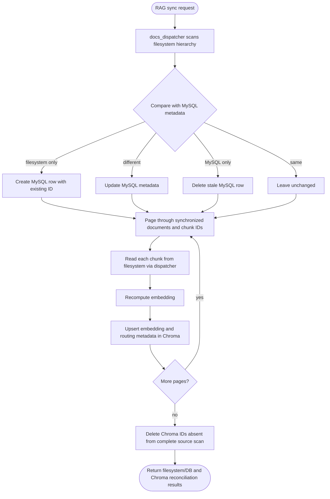
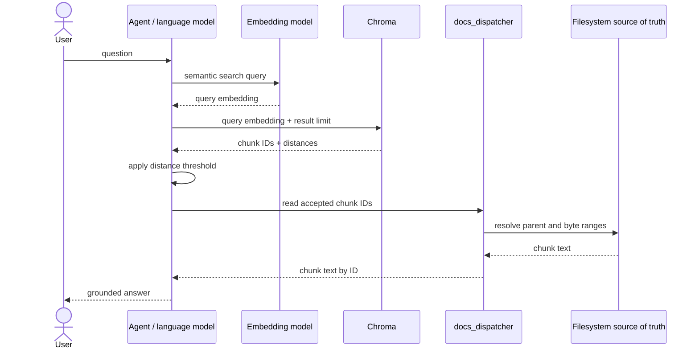

# Agentic RAG implementation, version 1

## Purpose and scope

This document describes the first implementation of the retrieval-augmented
generation (RAG) agent in `ai_agents_framework/ai_agent` and the supporting
`docs_dispatcher` service. It focuses on document ingestion, storage ownership,
synchronization, retrieval, and recovery after a partial outage.

The central design decision is that the filesystem hierarchy is the source of
truth for document content and its structural metadata. MySQL is an index and
unique-ID authority, while Chroma is a derived semantic-search index. Neither
database owns or duplicates the document content.

## Architectural decisions

1. **All durable document writes go through `docs_dispatcher`.** The dispatcher
   is a standalone container and provides a boundary between the RAG agent and
   the configured persistence backend. It selects the active backend from its
   configuration rather than embedding storage-specific logic in the agent.
2. **The filesystem is authoritative.** The document hierarchy is persisted in
   a Docker volume mounted at the dispatcher's storage path. The volume is the
   source of truth for documents, chunks, metadata, and their relationships.
3. **MySQL generates stable unique IDs and mirrors metadata.** MySQL allocates
   IDs for documents and chunks and holds searchable records such as the source
   URI, byte offset, size, parent ID, document type, and user metadata. These
   records are a replica of the filesystem hierarchy, not a second content
   store.
4. **Chroma stores the derived vector index, not document text.** Each Chroma
   record contains a chunk embedding and routing metadata (document ID, chunk
   number, and chunk ID). The actual chunk text remains on the filesystem and
   is fetched through `docs_dispatcher` only after vector search returns IDs.
5. **Both indexes are rebuildable.** `docs_dispatcher` reconciles MySQL from the
   filesystem, and the RAG synchronization endpoint reconciles Chroma from the
   same filesystem-backed document hierarchy. A database outage therefore does
   not permanently orphan a document that was committed to storage.
6. **Encryption is a future storage concern.** The current Docker volume is not
   encrypted by this implementation. Encryption at rest may be added later at
   the volume, filesystem, or storage-backend layer without changing the agent's
   dispatcher-facing contract.

## Component and ownership model

<!-- markdownlint-disable MD013 -->

| Store | Owns | Does not own | Recovery role |
| --- | --- | --- | --- |
| Docker-volume filesystem | Original document bytes; hierarchy records for documents and chunks; offsets, sizes, parent relationships, type, and metadata | Embeddings | Authoritative input for rebuilding both indexes |
| MySQL | Generated document/chunk IDs and a metadata replica used for enumeration and lookup | Document or chunk content | Reconciled from filesystem records by `docs_dispatcher` |
| Chroma | Chunk embeddings and minimal routing metadata | Original documents and chunk text | Reconciled by rereading chunks from the filesystem and recomputing embeddings |

<!-- markdownlint-enable MD013 -->

The current backend code is named `mysql` and supports a MySQL connection. A
deployment may point the same SQLAlchemy-based implementation at SQLite for
local or test configuration; this does not change the ownership model above.

## Ingestion pipeline

### Public inputs

The add-document operation accepts a URI, document type, optional metadata, and
either inline document data or data read from the URI. The agent currently
supports splitting text documents. It uses a recursive, token-aware splitter
with a maximum chunk size of 220 tokens, a 30-token overlap, and paragraph,
line, sentence, word, and character fallbacks.

### Processing and commit order

Conceptually, a document is persisted first and then transformed into chunks
and embeddings. The version 1 implementation optimizes this by splitting the
input and calculating its embeddings in memory before the first durable write.
Its **durable commit order** still preserves the required ownership boundary:

1. The agent partitions the input and computes an embedding for every chunk.
   Nothing is durable yet.
2. The agent calls `docs_dispatcher` to store the complete document.
3. The configured backend creates a MySQL row to allocate the document's unique
   ID, writes the document and hierarchy metadata to the filesystem, and updates
   the mirrored database record.
4. The agent asks `docs_dispatcher` to attach each chunk. MySQL allocates a
   unique chunk ID. The filesystem record points to a byte range in its parent
   document, so the chunk's text is not copied into either database.
5. Only after the document and chunk records are durable does the agent add the
   precomputed chunk embeddings to the Chroma collection. Chroma receives the
   chunk IDs and metadata, but not the chunk text.
6. The endpoint returns the document ID and its chunk IDs.

### Filesystem representation

Each document or chunk ID has a directory beneath the configured storage root.
A full-document directory contains the document file plus sidecar entries for
its parent ID, offset, size, type, and metadata. A chunk directory contains the
same structural information, but its `parent_id`, `offset`, and `size` identify
a byte range in the parent document. Consequently, reading a chunk resolves the
parent document on the filesystem and returns only that range.

This representation is why the filesystem can reconstruct the SQL metadata
index without needing the original database and why MySQL does not need a blob
column containing document text.

### Failure behavior during ingestion

The agent treats the filesystem/metadata write and Chroma indexing as one
logical operation. If attaching chunks or inserting into Chroma fails after the
document has been created, it requests deletion of the document through
`docs_dispatcher`. Deleting the parent also deletes its chunks. If rollback
itself fails, the operation reports that records may be inconsistent; the sync
operation described below is the recovery path.

## Synchronization and outage recovery

Synchronization is deliberately ordered from the source of truth toward the
derived stores.

### Phase 1: filesystem to MySQL

`docs_dispatcher` scans the storage root and reconstructs a storage record from
each numeric ID directory and its sidecars. It then compares those records with
the MySQL metadata table:

- filesystem-only IDs are inserted into MySQL with their existing IDs;
- records present in both places are updated when their URI, offset, size,
  parent ID, or document type differs;
- MySQL-only records are deleted; and
- matching records are left unchanged.

This direction is intentional: a MySQL outage during an earlier write cannot
cause a successfully persisted filesystem record to be omitted forever. The
next synchronization recreates the missing metadata record while retaining the
stable filesystem ID.

### Phase 2: filesystem hierarchy to Chroma

After phase 1 succeeds, the RAG sync operation pages through the document and
chunk hierarchy exposed by `docs_dispatcher`. For each chunk it:

1. reads the chunk text by ID from the filesystem through the dispatcher;
2. recomputes the embedding with the same embedding model used for queries;
3. upserts the embedding under the string form of the chunk ID; and
4. attaches only routing metadata (`doc_id`, `chunk_num`, and `chunk_id`).

The synchronizer records all source chunk IDs across all pages. Only after every
page and chunk has been read successfully does it delete Chroma IDs that are no
longer present in the source hierarchy. This delayed deletion prevents an
incomplete scan from treating unread source records as stale vectors.

The sync response reports the filesystem-to-database result and the Chroma IDs
created, updated, and deleted, as well as counts before and after reconciliation.

## Retrieval and agent execution

At question time, the same embedding model converts the search query into a
vector. Chroma compares this vector with its stored embeddings and returns chunk
IDs and distances. The agent rejects results beyond its configured distance
threshold and asks the dispatcher to resolve the accepted IDs into chunk text
from the filesystem. Only then is the retrieved content assembled into model
context and passed to the language model as tool output.

This two-step retrieval is essential to the no-content-duplication rule: Chroma
performs similarity search, whereas `docs_dispatcher` remains the only path by
which the agent obtains stored document text.

## Consistency model and invariants

The implementation provides eventual reconciliation rather than a distributed
transaction across the filesystem, MySQL, and Chroma. The following invariants
define a healthy state:

- every full document and chunk has one stable numeric ID;
- each chunk's parent ID refers to a full document;
- the chunk's offset and size select content within that parent document;
- MySQL metadata matches the corresponding filesystem sidecars;
- Chroma contains one vector per current chunk ID and no vector for deleted
  chunks;
- ingestion and querying use the same embedding model and configuration; and
- document or chunk text is absent from MySQL and Chroma.

Transient violations can exist between writes or after an outage. Run the RAG
sync endpoint to restore the indexes, always preserving the filesystem as the
authority. Operators should avoid editing MySQL or Chroma as a way to change
document content because a later sync will overwrite those derived states.

## Security and future encryption

Version 1 relies on deployment-level access controls for the Docker volume,
database services, shared API mount, and network. It does not itself encrypt the
persisted documents. A future encrypted-storage implementation should preserve
these properties:

- encryption and decryption occur behind the `docs_dispatcher` boundary;
- plaintext document content is never added to MySQL or Chroma;
- filesystem enumeration can still recover stable IDs and structural metadata,
  or an authenticated encrypted equivalent of that metadata;
- synchronization can read and embed authorized content without making a
  second persistent plaintext copy; and
- key loss, key rotation, backup, and restore procedures are defined before the
  encrypted backend becomes authoritative.

## Implementation map

<!-- markdownlint-disable MD013 -->

| Concern | Implementation |
| --- | --- |
| Add orchestration, splitting, embedding, dispatcher calls, Chroma insert, rollback | `ai_agents_framework/ai_agent/sources/rag_add.py` |
| End-to-end filesystem/MySQL and Chroma reconciliation | `ai_agents_framework/ai_agent/sources/rag_sync.py` |
| Vector lookup, thresholding, context assembly | `ai_agents_framework/ai_agent/sources/rag_answer_question.py` |
| Chunk reads through the dispatcher | `ai_agents_framework/ai_agent/sources/docs_retriever.py` |
| Dispatcher backend selection | `ai_agents_framework/docs_dispatcher/sources/dispatcher_backend_config.py` and `sources/backend/dispatcher/current` |
| Filesystem record model | `ai_agents_framework/docs_dispatcher/sources/backend/mysql/doc_storage/` |
| MySQL metadata model and ID generation | `ai_agents_framework/docs_dispatcher/sources/backend/mysql/app/models.py` |
| Filesystem-to-MySQL synchronization | `ai_agents_framework/docs_dispatcher/sources/backend/mysql/sync.py` |

<!-- markdownlint-enable MD013 -->
