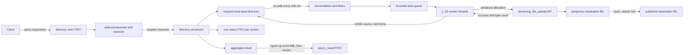

# Bulk directory ingestion: implementation v1

## Scope and conclusion

This document evaluates the implementation at commit `82237f9` against the
initial design in [Review.md](./Review.md). It describes the code as it exists
after the performance experiment in `4ec6edd` and the stability rollback in
`82237f9`.

The implementation delivers a usable bulk-directory ingestion API with bounded
worker concurrency, safe per-file publication through the existing
`streaming_file_upload` API, immediate removal of successfully transferred
staging files, filtering, progress FIFOs, error tolerance, and aggregate final
statistics. The central correctness invariant from the design is present: a
staging file is removed, and `done` is emitted, only after the nested upload
reports success and the byte counts agree.

It is not, however, the exact architecture proposed in the initial design. The
current version uses repeated full-tree polling instead of an event observer,
puts the real staging directory in the API request directory instead of a
shared tmpfs reached through a symlink, serializes nested request allocation,
and performs one synchronous file flush per copied file. These choices favor
the stability of the existing pseudo-filesystem protocol, but impose a clear
performance ceiling for large collections of small files.

The present version should therefore be treated as a stable functional
baseline, not as the final high-throughput implementation.

## Current architecture



### Request and channel lifecycle

The generated `streaming_directory_upload` endpoint invokes the same deferred
launcher and executor used by single-file upload. The directory processor
supports the same three modes anticipated by the design:

1. `--check-arguments` validates the request before allocation.
2. `--prepare-api-channel` creates a real `input` directory and one
   `status-<worker-id>` FIFO per worker.
3. Normal execution creates the destination root, reconciles staging content,
   schedules files, waits for the quiet period, and prints one aggregate JSON
   result.

The readiness report includes `input`, `input_type=DIRECTORY`, the status FIFO
list, `status_type=FIFO[]`, and protocol `cmvp.directory-upload.v1`. The common
executor adds `async_result`.

Unlike the design, `input` is not a symlink to `/dev/shm/file-uploader`. It is a
real directory under the deferred request directory. This makes the returned
path directly usable by both the container and a host that mounts the API tree.
A deployment can still put the shared API volume on tmpfs, but tmpfs is no
longer an implementation requirement or something the processor verifies.

### Discovery, stability, and completion

There is no recursive `watchdog` or inotify observer in the directory
processor. A single monitor repeatedly runs `os.walk()` over the entire staging
tree at a 100 ms interval. A regular file becomes eligible when its identity
tuple—device, inode, size, modification time, and filter decision—is unchanged
across two scans. This closes the common race where `os.walk()` observes a file
that a worker has just removed, because `lstat_if_exists()` treats that
disappearance as normal concurrent activity.

The stable-two-scans rule is practical but is not equivalent to a close-write
event. A producer that pauses for more than one scan interval while keeping a
file open can make a partial file eligible. Producers should therefore copy to
a private temporary name and atomically rename the completed file or tree into
`input` whenever possible.

Completion remains idle-driven. Before any activity, the initial timeout
applies. After activity, the processor completes only after the update quiet
period, an empty task queue, no active workers, and no unscheduled staging
files. Failed files may remain in staging until request cleanup and do not keep
a tolerant request alive forever.

### Filtering and admission

The original ambiguous `file_regex` was replaced by four explicit full-match
filters:

| Parameter | Current default | Meaning |
| --- | --- | --- |
| `file_allow_regex` | `.*` | A file must match to be copied. |
| `file_skip_regex` | `(?!)` | A matching file is excluded; skip wins over allow. |
| `dir_allow_regex` | `.*` | A directory subtree must match to be accepted. |
| `dir_skip_regex` | hidden/cache pattern | A matching directory subtree is excluded. |

The default directory skip expression excludes hidden directories,
`__pycache__`, `__pypackages__`, and `node_modules` at any level. Excluded
files and directories do not consume file or directory admission counts.
Zero-byte regular files are also excluded. Filtered and zero-byte regular files
are deleted from staging and counted in `files_skipped`.

Symlinks, hard-linked files, FIFOs, sockets, devices, and other unsupported
nodes are never followed or uploaded. They are removed from staging and are
reported through `items_skipped` and `items_skipped_path`. In other words,
`files_skipped` means a regular file was intentionally filtered, while
`items_skipped` means the node type was unsupported.

The configured bounds are 1,024 bytes per relative path, 64 path components,
10,000 accepted files, 10,000 accepted directories, and 100 GiB. File and
directory counts are cumulative by relative name and correctly exclude regex-
filtered content. The byte check is weaker: it currently sums only allowed
files present in the current scan. Since completed sources are deleted, a long
stream can cumulatively transfer more than 100 GiB while never having 100 GiB
present in one scan. This differs from the initial design's total-observed-byte
limit and should be corrected.

### Per-file transfer and durability

Each worker derives the nested session `<parent>.worker-<id>` and reuses that
name sequentially. Every accepted file is sent through the generated
`streaming_file_upload/POST/exec` API; the directory processor does not invoke
the single-file processor directly.

Allocation is protected by one process-wide `nested_allocation_lock`. The lock
covers writing the shared exec FIFO and consuming the corresponding handshake.
This is required by the current EOF-framed FIFO protocol: concurrent writers
can otherwise be read as one combined request. File data transfers happen
concurrently after their handshakes, but request allocation itself is serial.

The worker validates that returned channels remain below the sibling API root
and are FIFOs. It opens the source with `O_NOFOLLOW`, checks that it is a
single-link regular file, revalidates device/inode/size after opening, and
copies in 64 KiB chunks. The nested request includes `expected_bytes`, so a
short or interrupted stream cannot be installed successfully.

The single-file processor writes to a temporary file in the destination,
checks `expected_bytes`, flushes and `fsync`s the file by default, and installs
it with a non-overwriting hard link. The directory worker deletes the staging
source only after nested `error_code == "0"` and exact agreement among source
size, sent bytes, and returned `received_bytes`. A failed source remains until
request cleanup.

`streaming_file_upload` now exposes `need_flush=true|false`, defaulting to the
backward-compatible safe value `true`. The directory implementation does not
set it to false, so current bulk ingestion still performs an `fsync()` for
every file. The attempted coordinator-level batching and `syncfs()` approach
was reverted after large uploads could stall.

The current sequence makes file contents durable before success, but it does
not `fsync()` destination parent directories or the final root. Consequently,
the namespace is atomically visible during normal operation, but the stronger
crash-consistency claim in the initial design is not fully implemented.

### Progress history

Every worker owns one nonblocking JSON-Lines status FIFO. Records contain
exactly `worker_id`, `path`, `bytes`, `total_bytes`, and `status`.

`in progress` is emitted only while `bytes < total_bytes`. `done` is emitted
only after nested success, exact byte-count validation, and source deletion,
with `bytes == total_bytes`. Failures emit `failed` with the last sent byte
count.

The initial design allowed intermediate progress to be coalesced and bounded
pending state to one record per worker. The current implementation intentionally
does the opposite: it keeps an ordered in-memory `deque` of every event that
could not be written because no reader was attached or the FIFO was
backpressured. A later reader can receive the entire pending history while the
processor remains alive.

This improves observability but removes the original memory bound. A client
that never reads status can cause memory growth proportional to event count.
The history is also not durable: it disappears when the processor exits, and a
FIFO has no acknowledgement telling the writer whether an already written
record was actually processed by the reader.

### Errors and the aggregate result

`tolerate_errors=false` preserves fail-fast discovery: a file error stops new
discovery after accepted work reaches a safe boundary. With
`tolerate_errors=true`, later files continue to be discovered and copied. In
both cases any failed file keeps the final `error_code` nonzero and its relative
path appears in `files_failed_path`.

For errors raised after the processing loop has been initialized—including
admission-limit failures—the result preserves the aggregate fields:

```json
{
  "error_code": "1",
  "error_description": "directory ingestion admission limit exceeded",
  "metadata": {},
  "path": "/uploads/tree",
  "files_completed": "387/387",
  "directories_completed": "470/470",
  "bytes_completed": 7191019,
  "files_failed": "0/387",
  "files_failed_path": [],
  "files_skipped": 18,
  "items_skipped": 0,
  "items_skipped_path": []
}
```

This is better operationally than replacing partial progress with only an
error. There is still an edge gap: failures before `process_directory()` enters
its monitored section, such as destination-root creation or nested-API lookup
failure, fall back to the top-level two-field error response.

The common executor no longer limits the result to one `_PC_PIPE_BUF` record.
It captures up to 64 MiB in a request-local file and streams that file through
`async_result` in 64 KiB chunks. This solves the practical 4,096-byte aggregate
result limit, but intentionally gives up the initial design's atomic one-write
publication. EOF and the single-writer lifecycle now frame the result.

## Comparison with the initial design

| Design decision | Current implementation | Assessment |
| --- | --- | --- |
| New `streaming_directory_upload` query | Implemented with generated endpoint, launcher, executor, and processor | Achieved |
| Three processor modes | Argument check, channel preparation, and normal processing are implemented | Achieved |
| Reuse common deferred lifecycle | Reused; executor was also extended to spool and stream results up to 64 MiB | Achieved with a larger semantic change |
| Request-scoped staging | Real directory in the API request directory | Achieved |
| Shared `/dev/shm` staging plus API symlink | Replaced with host-visible real directory; tmpfs is deployment-optional | Not implemented by design choice |
| Recursive event observer | Replaced with full `os.walk()` reconciliation every 100 ms | Not implemented |
| Bounded worker pool and queue | 1–32 threads; queue capacity is `max(32, workers * 4)` | Achieved |
| Existing single-file API as the only file integration boundary | Every file uses the generated pseudo-filesystem API | Achieved |
| `expected_bytes` for nested uploads | Added and mandatory for directory workers | Achieved |
| Per-worker derived session reuse | `<parent>.worker-<id>` is reused | Achieved |
| Bounded retry for delayed duplicate-session cleanup | No explicit retry/backoff is present | Not achieved |
| Concurrent nested allocation | Allocation is serialized through one lock; data transfer is concurrent | Partially achieved |
| Source deletion only after confirmed success | Success and all byte counts are validated before unlink | Achieved |
| Atomic, non-overwriting file visibility | Temporary file plus `link()` preserves this | Achieved |
| Destination namespace durability | File data is `fsync`ed; destination directories are not | Partially achieved |
| One status FIFO per worker | Implemented | Achieved |
| Bounded/coalesced status backpressure | Replaced by full in-memory pending history | Deliberate deviation with memory risk |
| `file_regex` allow semantics | Replaced by explicit file and directory allow/skip filters | Better than proposed |
| Zero-byte handling | Zero-byte files are filtered, deleted, and counted | Added after the design |
| Aggregate statistics on processing errors | Implemented for monitored processing errors | Mostly achieved |
| Atomic `async_result` record | Replaced by bounded 64 MiB streaming publication | Not implemented; capacity improved |
| Admission excludes filtered paths | Implemented for file, directory, and byte checks | Achieved, subject to cumulative-byte bug |
| Initial/update quiet-period completion | Implemented using reconciliation state | Achieved without event-race guarantees |
| Bounded shutdown in every phase | Several waits are bounded, but FIFO open/read and `tasks.join()` can still block | Partially achieved |
| Empty destination-directory pruning | Bottom-up `rmdir()` removes empty output directories | Achieved |

## What became better than the initial proposal

* The real staging directory is directly usable from a host-mounted API tree;
  there is no container-only absolute symlink that can be dangling for clients.
* Filter semantics are explicit. Separate allow and deny expressions exist for
  files and directories, skip takes precedence, and common hidden/cache trees
  are excluded by default.
* Excluded content does not consume file or directory admission capacity.
* Zero-byte files and unsafe filesystem node types have explicit behavior and
  separate accounting.
* `tolerate_errors` permits useful work to continue without disguising the
  final partial failure.
* Aggregate statistics survive admission and other monitored processing
  errors, so the caller can see what was already copied.
* Vanishing paths during reconciliation are handled as a normal worker/scan
  race instead of aborting the request with `ENOENT`.
* Status history is more useful to intermittent readers, and a completed file
  no longer receives both a final `in progress` and a `done` event at the same
  byte count.
* The executor can return realistic aggregate path lists larger than the
  platform's typical 4 KiB `PIPE_BUF`.

## What remains weaker or incomplete

* Polling the whole tree is more expensive and less precise than observing
  close-write/move events with reconciliation as a fallback.
* A stable snapshot does not prove that the producer closed the file.
* Nested request allocation is a serial bottleneck, and the designed bounded
  duplicate-session retry is absent.
* Every file still creates a nested deferred request, executor, processor,
  input FIFO, result FIFO, temporary file, and synchronous `fsync()`.
* The 100 GiB admission limit is not cumulative across files already copied
  and removed.
* Unsupported-item paths and pending status history are not admission-bounded;
  both can grow independently of accepted-file limits. Large metadata can also
  consume the 64 MiB result budget. If processor output exceeds that budget,
  the executor replaces it with a generic error and aggregate detail is lost.
* Result publication is no longer atomic. A disconnected reader can observe a
  prefix, although the request has one writer and EOF framing.
* Destination directory entries are not explicitly synchronized, so power-loss
  durability is weaker than the design states.
* Startup failures can still produce only `error_code` and
  `error_description`, without the full aggregate schema.
* The implementation does not preserve empty source directories in the final
  tree; `directories_completed` describes accepted/discovered directories,
  not necessarily directories that remain after pruning.
* Reusing a relative path later in the same request is not supported: the
  cumulative `queued` set treats it as already handled.
* Some blocking points are not fully governed by cancellation deadlines,
  especially FIFO opens/reads and the unbounded `tasks.join()` during cleanup.

## Verification status

The repository's directory tests cover preflight, channel creation, nested
FIFO framing, worker-session reuse, source deletion, progress semantics, late
status readers, 40-event backlog retention, unsafe nodes, error tolerance,
the reconciliation `ENOENT` race, filters, aggregate error results, and
admission errors. Single-file tests cover `expected_bytes`, `need_flush`,
temporary-file cleanup, conflicts, binary data, and timeouts. Executor tests
cover results larger than `PIPE_BUF` and the 64 MiB capture policy.

At this snapshot the following local command passes:

```text
python3 -m pytest -q utility/file-uploader/tests/functional common/test_deferred_query_executor.py
30 passed
```

This number requires context: the two live-container directory tests return
immediately when `/api` is absent, so a local green run does not prove the full
generated API, process, FIFO, and storage integration. The tree-equivalence
container test creates random 32-byte files and checks a complete manifest, but
its current `near_limit` value is about half of the 10,000-file and
10,000-directory limits (4,950 for current constants), not genuinely just below
the limit.

Important missing or incomplete automated coverage includes a true limit-scale
run, cumulative byte admission after source deletion, producer writes paused
between scans, duplicate-session retry/collision, in-flight shutdown at every
blocking point, result-reader disconnection during a multi-write result,
unbounded status/unsupported-item pressure, destination crash durability, and
end-to-end verification on the actual Compose deployment in every test run.

## Performance concerns

No reproducible benchmark is checked into the repository, so the percentages
below are directional estimates, not measured results, and are not additive.
The dominant cost depends strongly on file size and storage latency.

| Bottleneck | Expected impact | Why it matters |
| --- | --- | --- |
| One deferred API/process lifecycle per file | Largest for small files; a persistent path could plausibly reduce elapsed time by 30–80% | Process startup, request directories, FIFO setup, JSON handshakes, and cleanup can cost more than copying a small payload. |
| Per-file synchronous `fsync()` | Often 20–70% on durable or remote storage; small on very fast storage | Every file waits for a durability barrier before its worker can complete. |
| Full-tree scan every 100 ms | Roughly 5–40%, potentially dominant near 10,000 tiny paths | Repeated `os.walk`, `lstat`, set construction, comparison, and Python path handling are O(tree size) per pass. |
| Serialized nested allocation | Increasingly visible as worker count grows | Workers can copy concurrently but must take turns requesting their next channels. |
| Two Python FIFO copy stages at 64 KiB | Usually 5–20% CPU/throughput opportunity for large files | Bytes travel from staging to Python to FIFO, then from FIFO to Python to destination. |
| Unbounded status backlog | Low when consumed; severe memory risk without a reader | Event serialization and retained byte strings grow with files and heartbeats. |
| Repeated parent creation and final recursive prune | Secondary, but visible for deep trees | `mkdir(..., exist_ok=True)` and final `rglob()` repeat metadata work. |

More workers do not remove the lifecycle, allocation, scanning, or durability
bottlenecks. Beyond the storage device's useful concurrency, additional workers
can increase seeks, metadata contention, nested processes, and context
switching without improving throughput.

## Recommended improvement path

### 1. Instrument before optimizing

Add per-request counters and timings for scans, paths examined, queue depth,
nested allocation latency, process lifetime, bytes copied, status backlog high
water mark, flush latency, and quiet-period time. Benchmark at least:

* 10,000 tiny files in shallow and deep trees;
* medium and large files with the same total bytes;
* local tmpfs, local persistent disk, and the deployment's real volume;
* 1, 2, 4, 8, 16, and 32 workers; and
* status continuously drained, intermittently drained, and never read.

This makes regressions such as the reverted large-directory stall visible
before release.

### 2. Remove per-file process churn without weakening the API boundary

The highest-value change is a bulk or persistent mode in
`streaming_file_upload`: allocate one long-lived nested session per directory
worker and send multiple framed file operations through it. The service can
still own path validation, temporary files, non-overwrite installation, byte
validation, and result generation, while avoiding one executor and processor
startup per file.

An alternative is to extract the safe destination-write primitive into a
shared, tested library or a long-lived internal service. Directly bypassing the
single-file API without first preserving its invariants would be a regression.

### 3. Change nested request framing before reducing the lock

Do not remove `nested_allocation_lock` under the current EOF-framed shared FIFO.
Appending a newline is insufficient because the existing server reads until
writer EOF, and multiple writers can overlap. Introduce a protocol with one
request FIFO per client, an atomic length-prefixed record guaranteed to fit
`PIPE_BUF`, or a Unix-domain socket with explicit framing. Only then can nested
allocations run concurrently safely.

### 4. Add a correct opt-in group durability mode

Keep per-file flushing as the default. If batch durability is needed, define an
explicit contract such as `durability=per_file|group` and ensure `done` and
source deletion occur only after the file's group barrier succeeds.

Avoid a global `syncfs()` on the destination filesystem: the reverted attempt
showed that it can wait for unrelated dirty data and stall the whole directory
upload. Prefer a long-lived destination owner that retains completed file
descriptors for a bounded group, calls `fdatasync`/`fsync` on those files in a
controlled background phase, then `fsync`s affected parent directories before
acknowledging the group. Bound both files and bytes per group and provide a
maximum flush interval.

### 5. Make reconciliation incremental but retain a correctness fallback

Two backward-compatible options are valuable:

* Use inotify/watchdog only as a dirty-directory hint. Scan changed directories
  incrementally, perform a full scan at startup and completion, and fall back
  to a full scan on queue overflow or watcher failure.
* Add an optional manifest-and-seal mode. A producer supplies normalized paths,
  sizes, and optionally hashes, then writes an explicit completion marker. The
  processor validates each listed path once and avoids guessing completion from
  quiet time.

The manifest option offers the greatest improvement for very large static
trees while preserving the current polling mode for existing clients.

### 6. Make progress history bounded and explicit

If complete reconnectable history is a requirement, a FIFO alone is the wrong
durable abstraction. Add monotonically increasing event sequence numbers and
write events to a bounded request-local append-only journal; use the FIFO only
as a wake-up/live stream. Let clients resume from a sequence number and either
acknowledge consumed records or accept a documented retention limit.

At minimum, cap the in-memory deque by records and bytes, report overflow in the
final result, and expose its high-water mark.

### 7. Close correctness and resource-bound gaps

Before raising admission limits:

* maintain cumulative accepted bytes, including already deleted sources;
* bound unsupported-item paths, metadata size, and status backlog;
* return the full aggregate schema for startup and shutdown failures;
* add bounded, interruptible FIFO opens/reads and worker joining;
* synchronize destination parent directories when crash durability is claimed;
* define whether a relative path may be submitted more than once; and
* make live-container tests explicit skips or mandatory CI jobs rather than
  silent early returns.

### 8. Optimize the copy path only after lifecycle costs are reduced

Benchmark larger buffers and Linux `splice()` from the staging file to the
nested FIFO, with a portable buffered fallback. This may reduce Python copying
and CPU for large files, but it will not solve the more important small-file
process, scan, allocation, and flush costs.

## TODO for a future implementation

The following work is required to move from the current safety-oriented v1 to
a scalable bulk-ingestion architecture. Items are ordered by expected value and
dependency rather than implementation difficulty.

- [ ] Establish a repeatable performance baseline for tiny, medium, and large
  files on tmpfs, local persistent storage, and the production volume. Record
  scan time, nested allocation time, process lifetime, copy throughput, flush
  latency, queue depth, memory high-water marks, and end-to-end elapsed time.
- [ ] Add a persistent bulk mode to `streaming_file_upload`, with one long-lived
  session per directory worker and an explicitly framed sequence of file
  requests and results. Preserve path validation, `expected_bytes`, temporary
  destination files, non-overwrite installation, and per-file acknowledgement.
- [ ] Replace the shared EOF-framed nested exec FIFO with a transport that can
  safely distinguish concurrent requests, such as per-client request FIFOs,
  atomic bounded records, or a framed Unix-domain socket.
- [ ] Remove `nested_allocation_lock` only after the new request framing has
  automated concurrency and non-interleaving tests. A newline added to the
  current protocol is not sufficient.
- [ ] Introduce an optional manifest-and-seal protocol for static directory
  trees. Validate normalized paths, sizes, and optional hashes once, and use an
  explicit seal as the completion boundary instead of relying only on quiet
  time.
- [ ] For the existing streaming mode, use filesystem notifications only as
  dirty-directory hints. Retain a full reconciliation scan at startup and
  completion, and fall back to it after notification overflow or watcher
  failure.
- [ ] Replace repeated full-tree scans with incremental dirty-directory scans
  and cached path state. Benchmark and verify that excluded subtrees do not
  consume admission limits or repeated reconciliation work.
- [ ] Design an opt-in group durability mode with bounded file, byte, and time
  thresholds. Do not emit `done` or delete a source until its group has crossed
  a successful file and parent-directory durability barrier.
- [ ] Keep per-file `fsync` as the default until group durability has crash and
  failure-injection tests. Do not reintroduce filesystem-wide `syncfs`, which
  can wait for unrelated dirty data and previously caused large uploads to
  stall.
- [ ] Synchronize affected destination parent directories before claiming
  power-loss durability, including the final destination root when new
  directory entries were installed.
- [ ] Replace the unbounded in-memory status deque with a bounded,
  sequence-numbered request-local journal. Define retention and acknowledgement
  semantics so a reconnecting client can distinguish delivered, unread,
  expired, and lost events.
- [ ] Maintain cumulative admitted bytes across the whole request, including
  files already copied and removed from staging.
- [ ] Bound metadata, unsupported-item paths, failed-path reporting, and status
  history by both record count and encoded bytes. Preserve aggregate counters
  even when detailed path retention reaches its limit.
- [ ] Return the complete aggregate result schema for pre-loop startup errors,
  cancellation, shutdown, and result-size failures, not only for errors inside
  the reconciliation loop.
- [ ] Make FIFO opens, handshake reads, task draining, and worker joining
  interruptible and governed by explicit deadlines. Add failure-injection tests
  for shutdown at every blocking point.
- [ ] Define and enforce the behavior for submitting the same relative path
  more than once in one request: reject it explicitly, version it, or support a
  documented replacement policy.
- [ ] Make live-container integration tests mandatory in CI. Replace silent
  early returns with explicit skips outside the intended environment and test a
  tree genuinely close to the configured 10,000-file and 10,000-directory
  limits.
- [ ] Add regression tests for paused producers, duplicate-session collisions,
  notification overflow, cumulative byte admission, absent status readers,
  result-reader disconnection, crash durability, and cleanup after partial
  failure.
- [ ] After lifecycle and reconciliation costs are reduced, benchmark larger
  buffers and Linux `splice()` with a portable fallback. Adopt them only when
  measurements demonstrate an improvement for the target storage systems.

## Final assessment

Implementation v1 satisfies the essential product behavior and the most
important per-file safety properties. It is materially more operable than the
initial proposal in filtering, partial-error reporting, host-visible staging,
and delayed status consumption. The stability rollback was the correct current
trade-off: it restored reliable framing and per-file durability after an
optimization caused large uploads to stall.

The largest remaining architectural issue is not worker count or buffer size;
it is the multiplication of a complete deferred single-file lifecycle by every
file, combined with full-tree polling and per-file synchronization. A
persistent bulk transfer protocol, correct group durability, and incremental or
manifest-driven reconciliation are the changes most likely to improve
throughput substantially without sacrificing the safety achieved in v1.
