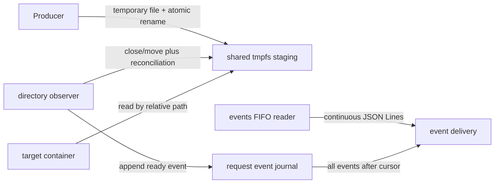

# Bulk directory ingestion: shared-staging event delivery

## Decision

> **Implementation note:** the implemented endpoint reuses the common deferred
> executor unchanged. Consequently, repeated batches use a processor-owned
> `events` FIFO, while the executor-owned `result` FIFO retains its legacy
> meaning: one final summary after the processor exits.

This architecture is possible, and it is substantially simpler than copying
every staged file through `streaming_file_upload`. It is appropriate when the
producer, directory processor, and consumers share the API volume; that volume
may be mounted at different absolute paths because request `input` links are
relative.

In this mode the directory processor is not an uploader. It is a **readiness
observer**:

1. the producer copies a file into the request's staging directory;
2. the processor decides that the file is complete;
3. the processor appends one `ready` event to a request-local event journal;
4. a consumer reads all events not yet returned for that request; and
5. the consumer reads the file directly from the shared staging mount.

There is no nested `streaming_file_upload` request, second byte copy,
destination temporary file, `/uploads` publication, per-file worker, or
per-file `fsync()` in this design. The endpoint should consequently be named
`streaming_directory_events` (or expose an explicit `mode=shared_staging`), not
silently change the durability and ownership contract of the existing
`streaming_directory_upload` endpoint.



## Mount and path contract

Staging is a hidden sibling of deferred requests on the query's shared API
volume: `POST/.staging/<request>`. The request tree contains an `input` symbolic
link whose target is relative to the request directory. Consequently, a host
may mount the API volume anywhere without also creating a root-level
`/staging`. The handshake returns the container's canonical `staging` path for
diagnostics, but portable clients should enter through `input` or translate the
equivalent path within their API-volume mount. A request identifier must be
validated as a safe base name, and the real staging path must remain below the
query-local `.staging` root after resolution.

An event carries a normalized relative path, never a producer-supplied
absolute path. A consumer reconstructs the path below the staging root and
must reject traversal or a resolved path outside that root. The processor must
continue to reject symlinks, hard links, and non-regular files.

## Defining “copied”

Observing that a pathname exists does not prove that its copy is complete.
The preferred producer protocol is:

1. copy bytes to a private temporary name in the same staging directory;
2. close the file; and
3. atomically rename it to its final relative name.

The observer emits `ready` after the final-name move/close event. Files that
appear directly under their final names retain the existing stable-snapshot
fallback, but the API must document that a producer pause can otherwise expose
a partial file. Inotify/watchdog should be used as a hint, with a startup scan,
periodic reconciliation, and a final scan after overflow or the quiet period.

A useful event is self-validating:

```json
{
  "sequence": 17,
  "status": "ready",
  "path": "src/module.py",
  "bytes": 4812,
  "mtime_ns": 1790769600123456789,
  "device": 42,
  "inode": 991,
  "request_id": "deferred-abc"
}
```

`sequence` is monotonically increasing within one request. `device`, `inode`,
size, and modification time let the consumer detect replacement between event
receipt and open. A content digest can be added when integrity is more
important than the extra read and CPU cost.

The processor reports that a staging file is **ready**, not that the target
container has consumed, persisted, or processed it. Those stronger states
require an acknowledgement from that container.

## Event FIFO semantics

### A FIFO read call cannot provide the requested guarantee

A plain FIFO is a byte stream. It has no message boundaries, read receipt, or
consumer acknowledgement. The kernel may split one write across reads or
coalesce many writes into one read. Therefore the statement “the next read
returns exactly the 40 events since the previous read” cannot be guaranteed by
a single `read(2)` call.

The implemented FIFO contract is:

* the client opens `events` and parses newline-delimited JSON batch envelopes;
* the writer remains connected and immediately writes newly ready events;
* absent-reader and backpressure records are retained and flushed together;
* the processor writes a final `terminated` event and then closes, making EOF a
  session boundary rather than a batch boundary; and
* sequence numbers let reconnecting clients detect gaps or duplicates.

For example, if sequences 1 through 40 are pending when a reader becomes
available, one backlog flush writes:

```json
{"first_sequence":1,"last_sequence":40,"events":[...40 event objects...]}
```

The batch may exceed `PIPE_BUF`, so a client must buffer until newline. It must
not assume that one language-level `read()` returns a complete JSON document.

### Delivery needs a journal, not an in-memory FIFO backlog

The processor should append each event to a bounded request-local journal
before announcing it. The FIFO is a delivery channel for journal records; it
is not the record store. This avoids losing all pending events when the
processor restarts and bounds memory when no reader is attached.

There are two viable cursor semantics:

1. **At-least-once, no acknowledgement.** Advance the server delivery cursor
   only according to an explicit `after_sequence` supplied on a request
   channel. A reconnect may replay events; the consumer deduplicates by
   sequence. This is the safer default.
2. **Acknowledged delivery.** Return a batch through `events` and accept
   `ack=<last_sequence>` through a separate request/ack FIFO. Compact the
   journal only after the acknowledgement. This precisely models “events read
   last time,” assuming the consumer acknowledges only after parsing the full
   batch.

Simply deleting events after `write()` is not sufficient: a successful FIFO
write proves only that bytes entered the pipe buffer, not that the consumer
read or processed them.

## Revised endpoint lifecycle

The existing deferred executor still owns one final result, its reader-retention
window, and request-directory cleanup. Repeated delivery is instead implemented
by the processor-owned `events` FIFO advertised in the extensible readiness
report. This preserves the common executor's legacy contract while adding these
processor lifecycle phases:

1. **Allocate:** create the shared staging directory, journal, `events` FIFO,
   and `seal` FIFO; return their paths in the handshake. The common executor
   separately adds its ordinary final `result` FIFO.
2. **Observe:** discover completed files and append readiness events.
3. **Serve:** retain the events writer and publish JSON-Line batches as soon as
   a reader and pipe capacity are available.
4. **Seal:** stop accepting files after a non-empty producer message on `seal`
   or, for compatibility, after `WaitQueryUpdateTimeoutSec` passes without a
   newly observed filesystem entity; then perform final reconciliation.
5. **Retain:** keep staged files and unacknowledged journal entries available
   for a configured retention period.
6. **Finish:** print one final summary to stdout. The common executor publishes
   it once through `result` and cleans request-local FIFOs and the journal.

`WaitQueryUpdateTimeoutSec` controls fallback sealing and defaults to five
seconds. `WaitResultConsumptionTimeoutSec` remains the common executor's final
result-reader retention window. Unread events do not extend either phase; the
final summary exposes generated, delivered, and undelivered counts.

Shared staging is outside the executor's request directory and therefore
survives final-result cleanup. An explicit acknowledgement can mean either
“event received” or “file no longer needed”; these should be separate
acknowledgements if a future processor is allowed to reclaim individual files.

## Backpressure and limits

The endpoint remains bounded even though it performs no byte transfer:

* cap staged files, staged bytes, directories, relative-path length, and depth;
* cap journal records and encoded journal bytes;
* stop admitting new final-name files when limits are reached rather than
  dropping readiness events;
* publish an overflow/error event when reconciliation detects content that
  could not be journaled;
* batch by both event count and encoded bytes; and
* define retention and cleanup behavior for abandoned requests.

Forty small events can normally be returned in one batch, but batching must
not rely on that number fitting the platform's `PIPE_BUF`. A maximum encoded
batch size is a safer limit than only a maximum event count.

## Differences from the current upload endpoint

| Property | Current `streaming_directory_upload` | Shared-staging event endpoint |
| --- | --- | --- |
| File bytes | Sent through a nested upload FIFO | Remain in shared tmpfs |
| Final location | Published below `/uploads` | Request staging path |
| Per-file result | Worker progress/done | One journaled `ready` event |
| Event FIFO | Worker status channels | Repeated framed event batches |
| Result FIFO | One aggregate final report | One final event-session summary |
| Durability | Per-file data `fsync()` by default | None; tmpfs lifetime only |
| Source cleanup | After confirmed nested upload | After release/expiry or consumer acknowledgement |
| Target isolation | Target needs `/uploads` | Target needs the shared API mount |
| Recovery | Persistent destination survives request cleanup | Journal and files require explicit retention |

## Recommendation

Implement this as a separate shared-staging event endpoint. Use a persistent,
sequence-numbered journal and treat `events` FIFO opens as batch-delivery
sessions. Keep the executor-owned `result` FIFO for its legacy one-shot final
summary. If
the exact “since I last read” behavior is mandatory, add an acknowledgement
FIFO (or use a socket/HTTP request carrying a cursor); an events FIFO by itself
cannot supply that guarantee.

This removes the dominant nested-executor and duplicate-copy cost while making
the trade-off explicit: it is a same-host/shared-mount notification protocol,
not a durable upload protocol.
