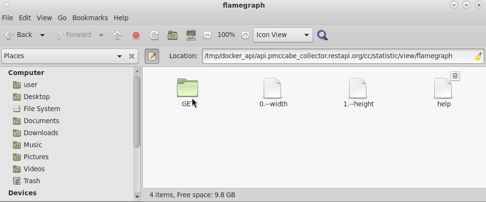
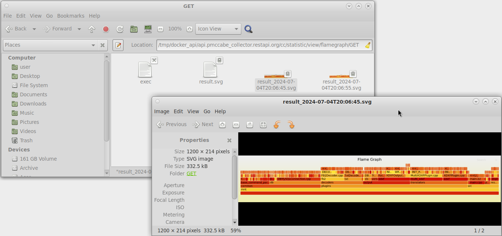
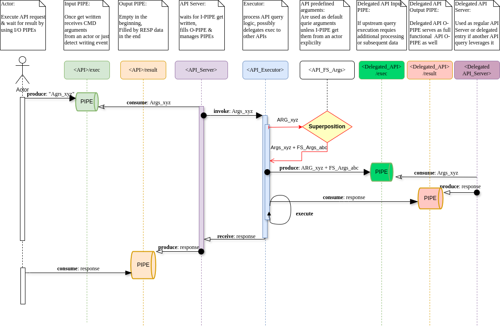
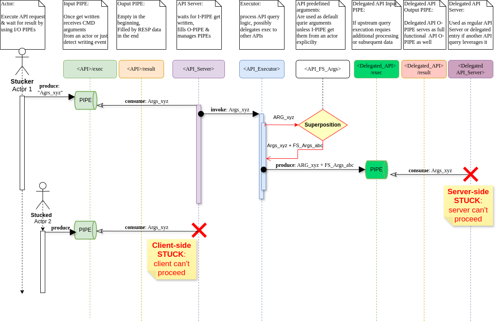
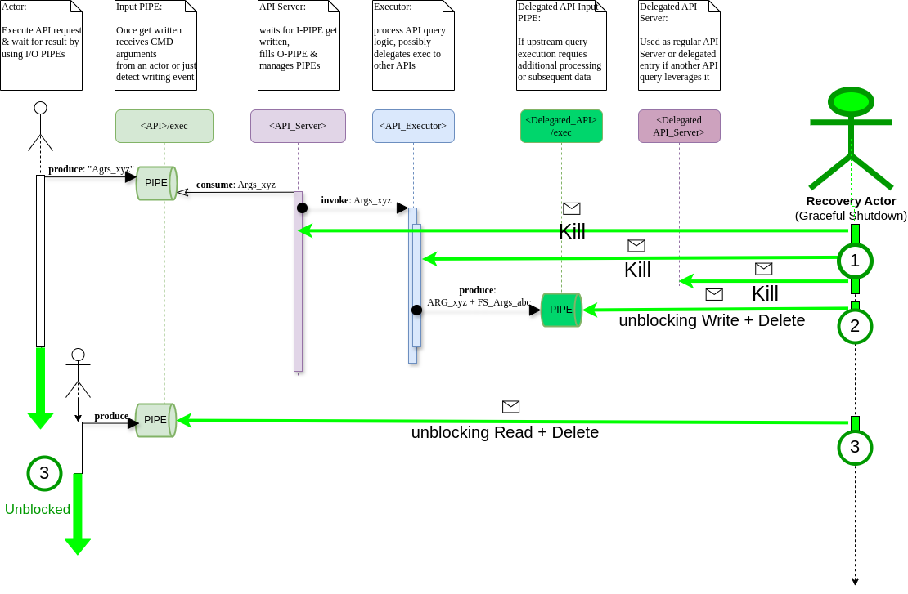

# Few words about using the pseudo-filesystem API

## CLI Transaction Semantic

The request

`GET api.pmccabe_collector.restapi.org/cyclomatic_complexity/statistic/view/flamegraph`

can be composed in the filesystem API mapped notation as the next transactional operation:

1) To initiate the request all you need is to send some data into the input PIPE `exec`:

`echo 0 > api.pmccabe_collector.restapi.org/cyclomatic_complexity/statistic/view/flamegraph/GET/exec`

which will establish IPC communication using pipes channel.

2) To extract a result of the operation just redirect read-request on the output PIPE `result.svg` into a destination file:

`cat api.pmccabe_collector.restapi.org/cyclomatic_complexity/statistic/view/flamegraph/GET/result.svg > ~/my_flamegraph.svg`

Together these two operations represent the transaction. Although, contrary to acustomed transaction semantic, getting a result through reading the output PIPE will supplement you with the result of the last initiated request only. Therefore the API system doesn't act as a persistent queue. Although the operation pretends to be a synchronous "transaction", in reality it is not: you don't have to wait for a result using the output PIPE upon a request started, intead you can initiate a new operation by commiting write-request of the input `exec` PIPE. In this case the result of the former "transaction" would be discarded and the output PIPE would produce a new portion of data related to the last request you made.
This discrepancy to the traditional transactional semantic was settled deliberately.
Having non-blocking `exec` has been found more beneficial in this simple one-threading server case rather than preserving the pure synchronous transactions semantic.
Having a single-threaded server and the pure synchronous transaction, a client would have been blocked on next `exec`-request until they consumed request of the previous transaction through the ouput PIPE.
And schema "Send request/collect result" would transform into "Don't forget to collect the previous result/send request/collect result" which is said to be more complicated.

Thereby the following considerations are settled down for the current implementation:
a) A read-operation on the output PIPE **MUST** block until no requests are made.
b) A request initiation by using a write-operation on the `exec` node **MUST** be a non-blocking operation
c) A read-operation on the output PIPE MAY block temporary until the request execution is still in progress.

## CLI request arguments

Each request has arguments which affects its execution directly. These arguments might be either major options with affect behavior or meaningless arguments like `verbose` specifier. These request arguments represented by files located by a dedicated filesystem path usually on the same level as request is ( `GET`, `PUT`, `POST` etc.).
A value of each arguments is a content of the argument file. You could changing that by changing the file content before execute the request by touching `exec` pipe. Please be notified that changing the content of the file is a way to change the argument value on persistent basis. Any other subsequent request will use the same argument value.
If you'd like to execute the requery with different argument value without it being modified in file, you could just recap those arguments as inputs string of `echo` composed list writing to the dedicated request pipe `exec` in the form:

`echo "arg_A=value_A arg_B=value_B arg_z=value_Z" > api.pmccabe_collector.restapi.org/cyclomatic_complexity/statistic/view/flamegraph/GET/exec`

In this case, the arguments recognizable by `flamegraph` request will be applied/overridden and elapsed arguments will be passed through this `flamegraph` request to any other subsequent requests which this compound `flamegraph` relies on (it invokes by itself several others).This allow to compose a very complex argument list for fine-grained customization in requests invocation. Also it's a very good way to play out and determine which value of arguments/setting you need for, before changing context of the argument-files permanently.

## CLI SPECIAL request arguments

As it was mentioned before the filebased API carry out a transaction based interaction. Since a write-operation on the `exec` side of PIPE is unbloking, but reading from `result` PIPE may be blocked it was designated (but not limited to) for single-user mode.
To support multi-user mode, or better say "multisession mode" the following extension was introduced through a special request argument **SESSION_ID**.
Given that **SESSION_ID** passed, for example:

`echo "SESSION_ID=<hostname>" > api.pmccabe_collector.restapi.org/cyclomatic_complexity/statistic/view/flamegraph/GET/exec`

we enforce a processing service to create an additional output PIPE suffixed by `<hostname>` and to write result of the transaction in that PIPE, which can be read in a typical way:

`cat api.pmccabe_collector.restapi.org/cyclomatic_complexity/statistic/view/flamegraph/GET/result.svg_<hostname> > ~/my_flamegraph.svg`

This additional PIPE were created to not interfere with other parallel request committed throught single `exec` input PIPE, which would have been overritten every time upon new request were made.
Please pay attention, that after **SESSION_ID** was manifested as `exec` arguments, there is a short delay before the OUTPUT PIPE would be created first time. It might be important in scripting this `echo` <-> `cat` pair, hence before execution `cat` on the OUTPUT PIPE please be sure that it has been created.

## GUI File Manager

If you prefer to use GUI rather than CLI, then you could just follow a path `api.pmccabe_collector.restapi.org/cyclomatic_complexity/statistic/view/flamegraph/GET` in your favorite File Manager.
Opening the directory `../GET`

triggers an inotify-event, and as soon as the request finishes you will find the result in a newly created file.

No any transactions in this case is meaning.
It is realy simple as it sounds! Regardless the approach you use (CLI or GUI).

## API stucks & recoverigng

Sometimes malfunction occurs and services become inoperable. Although data loss is not very critical here, the filesystem API processing might stuck due to impossibility for finishing any current transaction. As any pipe requires both sides opening for reading and writing to proceed, it means that half-opened pipe may keep such a one-sided process "on a hold" without progressing.
Please check a sequnce diagram of API services invocation:

The situation the more accute the more "Delegated API" engaged in that communication. The "hang on"  mechanism depicted on the following sequence diagram:

To endure this situation a recover routine was introduces. At the moment this routine as a part of gracefull shutdown mechanis of any API-producing services and may be expanded later as a standalone service.
The interactions in case of recovery execution are showed in the diagram below:

