# Code Metric Visualizer Platform

The docker image for `pmccabe_visualizer` https://github.com/SergeyIvanov87/pmccabe_visualizer

The service implementation is still in progress and it has limited functionality.
The service is configured and assembled for different use-cases which are proposed through `docker compose` files. The use-cases would be described in that document later. Only local-machine (Linux tested only) docker images are shipped at the moment.
The service is supposed to monitor/to collect various metrics of code in a C/C++ project. For the moment the only `cyclomatic complexity` is introduced. For more information about `cyclomatic complexity` and how to use id please refer to an appropriate [article](https://en.wikipedia.org/wiki/Cyclomatic_complexity) or for another [repository of mine](https://github.com/SergeyIvanov87/pmccabe_visualizer)

Launching this service by targeting it on your local C/C++ project (or repository), you could leverage API populated by this service to collect, manifest and govern metric subsets.
All communication with the particular `microservice`/docker container is available either through simplest pseudo-filesystem API, which is populated in [API manifest](cyclomatic_complexity/API.fs), or using HTTP queries if you decided to employ [REST API](rest_api).
Whatever you prefered, the API subset remains the same. Thanks to the REST ideology, it is possible to generate both sets of API: requests could represent a particular hierarcy structure, thus `pmccabe_collector` leverages this idea and maps those API requests as a structure of nodes mapped to a filesystem hierarchy as directories and files inside the populated API-entry point `api.pmccabe_collector.restapi.org` resided in your project directory.
Each request can be executed as simple ACCESS-operation on a file named `exec` or `modify_this_file` in the bottom of relevant filesystem hierarchy in the same way as the Linux `/proc` pseudo-filesystem employed in order to read (and/or store) some system settings. For more information how to use psedo-filesystem API please follow this document [How-To-Use-API](HowTo/How-To-Use-API.md)

# Functionality overview

### Cyclomatic Complexity (CC) Microservice

This microservice provides functionality for calculating CC and representing CC using various ways either textual or graphical. The textual form uses XML format (not the best choise) for representation (through the API [statistic](cyclomatic_complexity/API/statistic.json)) and encompasses all project modules/packages undergo this analysis.
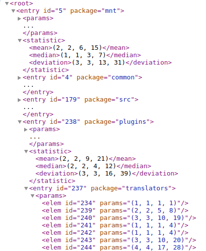

The desired project modules/packages as well as other criterias can be filtered by modification of appropriated settings using CC API [watch_list](cyclomatic_complexity/API/watch_list.json)
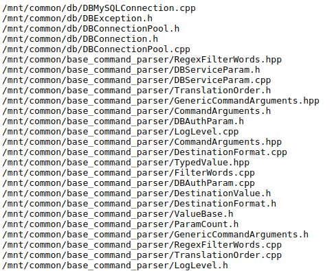

The graphical form uses SVG and flamegraph representations leveraging the API [flamegraph](cyclomatic_complexity/API/flamegraph.json).

You can read about how to use them in my [article](https://www.linkedin.com/pulse/building-visualizing-cyclomatic-complexity-cc-projects-sergei-ivanov-qdxzf).

### Round-Robin Database (RRD) Microservice

This microservice provides functionality for accumulating measured metrics like CC (and only CC at the moment) in the [Round Robin Database](https://oss.oetiker.ch/rrdtool/) allow us watching and monitoring how the metric values are progressing or degrading during period of time (1 year by default). The microservices creates database files for collecting results gathered by CC microservice and populate API to build trends using both textual and graphical representations.
Along with the previously described CC microservice this one can also filter databases-modules, which are comprised into trend formations, using the appropriate API [rrd_select](rrd/API/rrd_select.json)

The textual form represented by CSV format and could be obtained using the API [rrd_view](rrd/API/rrd_view.json):
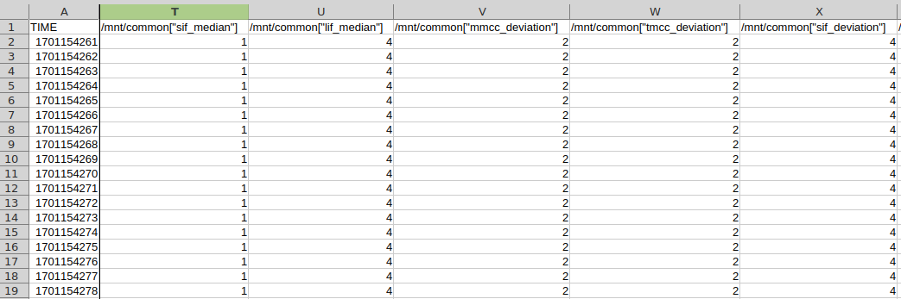

The graphical form representation uses intrinsic RRD plot printing functionality and leverages image editing tool [Imagemagick](https://imagemagick.org/index.php) to depict the graphical trend of a code metric:
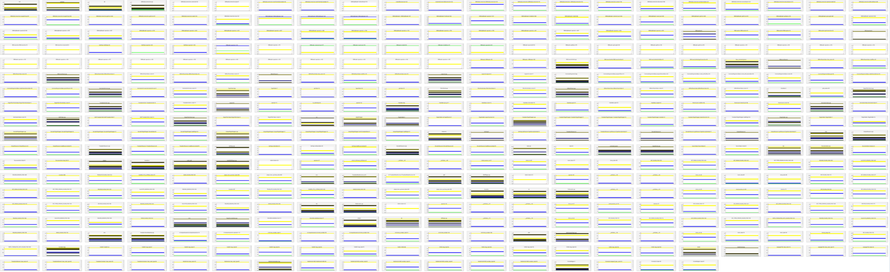

Of course you can filter out non-interesting project modules or simply use Zoom-In/Out on the existing picture:
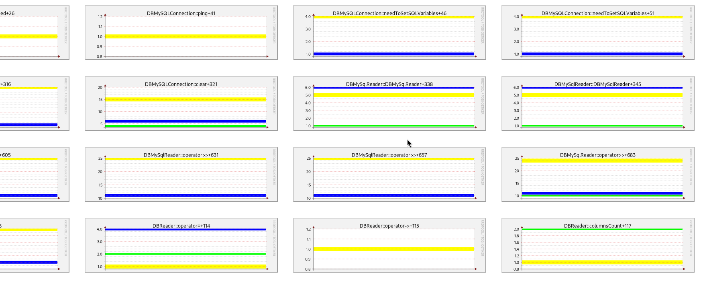

### REST-API Microservice

The service listens to filesystem API changes carried out by other microservices, gathers these and populate those API by setting a HTTP service up which is ready to serve HTTP requests relevant to gathered pseudo-filesystem API entry points.
The HTTP service portal is depicted on the picture below:
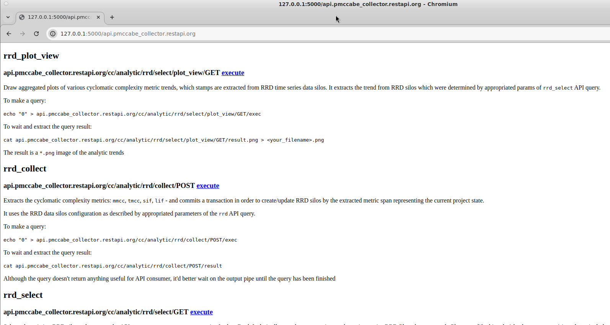

Clicking on a emphasized link mkes it possible to execute other container APIs using your browser:

[rrd_view](rrd/API/rrd_view.json):
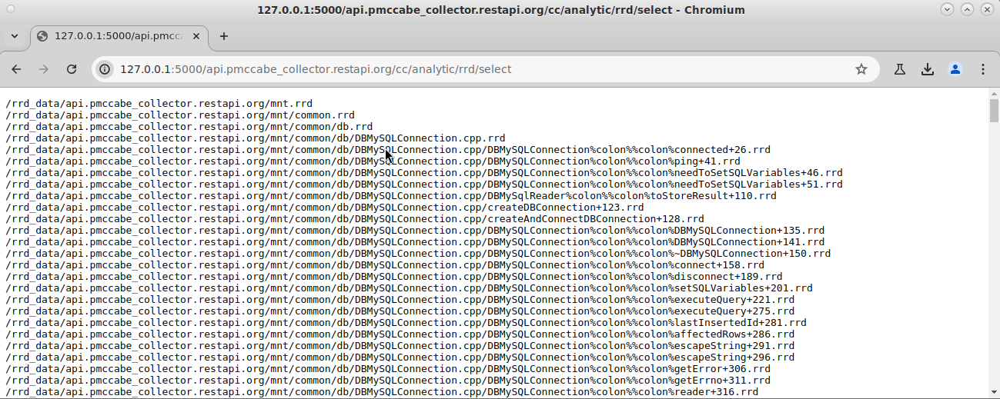

or [rrd_plot_view](rrd/API/rrd_plot_view.json):
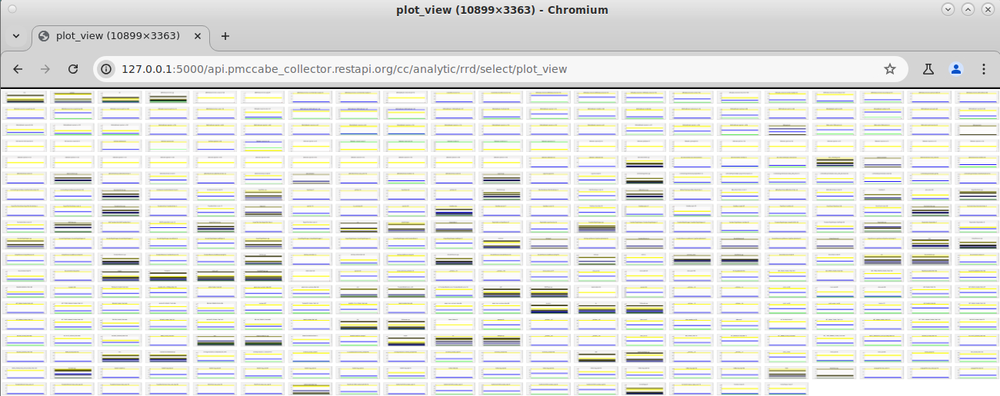

or [flamegraph](cyclomatic_complexity/API/flamegraph.json) with additional images scaling parameters passed as CGI arguments of the HTTP query
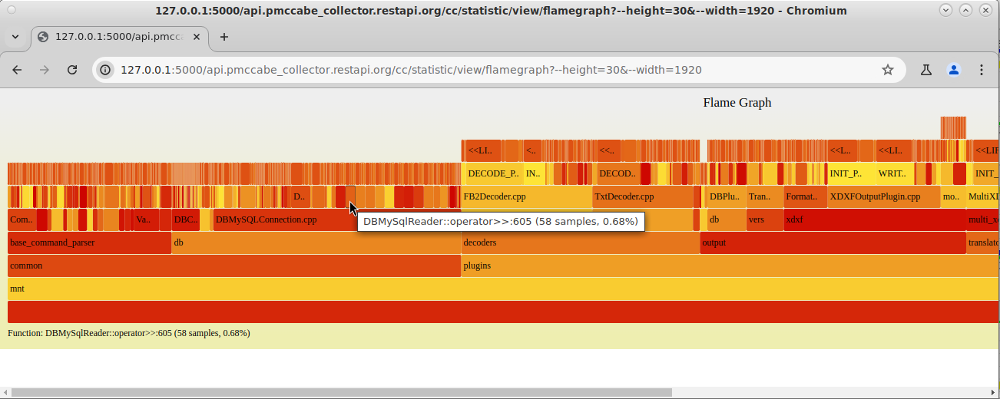

# Use-Cases (UCs)

There are few supported use-cases which are embodied by using different set of images and their orchestration/choreography in that repository:

### Analysis UC

To collect & check code metrics during your casual activities or making refactoring by demand using provided API.
The choreography of microservices depicted on the diagram placed in the [diagrams folder](diagrams):
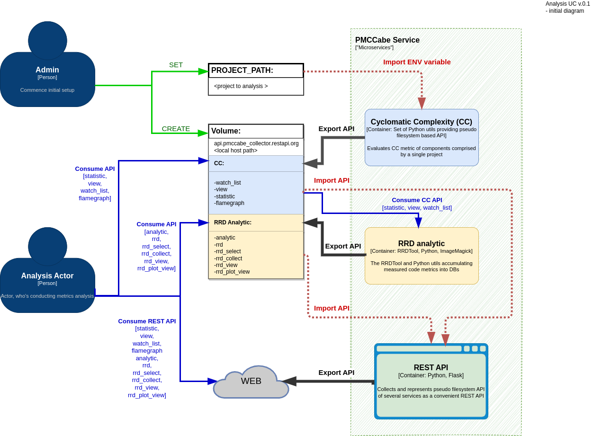.

The UC encompasses the following microservices:

- [cyclomatic_complexity](cyclomatic_complexity/README.md)
- [rrd](rrd/README.md)
- [rest_api](rest_api/README.md)

### Analytic UC

Collect & store code metric in [Round-Robin-Database](https://oss.oetiker.ch/rrdtool) on a regular basis automatically.
The orcestration of microservices by a special microservice `Service Broker` depicted on the diagram placed in the [diagrams folder](diagrams):
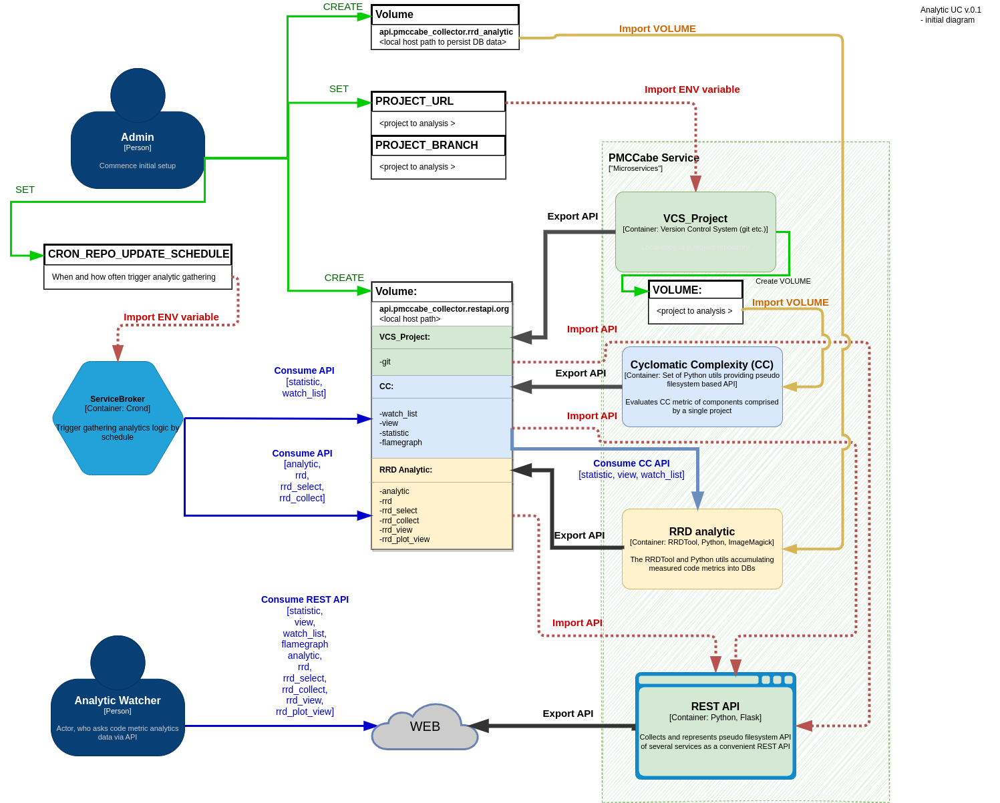

The UC encompasses the following microservices:

- [observable_project_version_control](observable_project_version_control/README.md)
- [cyclomatic_complexity](cyclomatic_complexity/README.md)
- [rrd](rrd/README.md)
- [rest_api](rest_api/README.md)
- [service_broker](service_broker/README.md)

# Prerequisites

### General

To be able to compose a use-case using docker images in this repo, the containers on a local host must communicate to each other.

- You **MUST** configure a docker volume `api.pmccabe_collector.restapi.org`, which will represent the point of functional service communications, by executing the following command:

    `LOCAL_HOST_MOUNT_POINT=<local host mount point> && mkdir -p ${LOCAL_HOST_MOUNT_POINT} && chmod 777 ${LOCAL_HOST_MOUNT_POINT} && docker volume create -d local -o type=none -o device=${LOCAL_HOST_MOUNT_POINT} -o o=bind api.pmccabe_collector.restapi.org`

Although `<local host mount point>` **SHOULD NOT** be employable by `Analytic UC`, you'd better create it.

- You **MUST** configure a docker network `api.pmccabe_collector.network`. which will be used as the point of inner service communications, logging and integrational tests like `Simian Army` etc., by executing the following command:

    `docker network create -d bridge api.pmccabe_collector.network`

- You **SHOULD** define environment variables `FLASK_RUN_HOST` and `FLASK_RUN_PORT` to determine where REST API service will listen incoming connections (default values `0.0.0.0` and `5000` respectfully).

### Analysis UC

In addition to **General** prerequisites above, you **MUST** define environment variable `PROJECT_PATH` when launching `docker compose  -f compose-analysis.yaml` (or use the following bind mount `--mount type=bind,src=${PROJECT_PATH}/,target=/mnt` for `docker run`), which **MUST** specify your source code project path.

### Analytic UC

In addition to **General** prerequisites above:

- You **MUST** configure a docker volume `api.pmccabe_collector.rrd_analytic`, which will store analyzed metrics snapshots in RRDs (Round-Robin databases), by executing the following command:

    `LOCAL_HOST_RRD_SHAPSHOT_MOUNT_POINT=<local host RRD mount point> && mkdir -p ${LOCAL_HOST_RRD_SHAPSHOT_MOUNT_POINT} && chmod 777 ${LOCAL_HOST_RRD_SHAPSHOT_MOUNT_POINT} && docker volume create -d local -o type=none -o device=${LOCAL_HOST_RRD_SHAPSHOT_MOUNT_POINT} -o o=bind api.pmccabe_collector.rrd_analytic`

- You **MUST** define environment variables `PROJECT_URL` and `PROJECT_BRANCH` when launching both `docker compose  -f compose-analytic.yaml` and `docker build`, which specify your project repository and branch( `git` by default).

- You **SHOULD** define the environment variable `CRON_REPO_UPDATE_SCHEDULE` to specify an analytic job invocation shedule (metrics collected every day, by default) in `crontab` format.

# HOW-TO

There are several ways to use these images: using `docker compose` to build and to launch all existing images or set them up using manual approach:

## To build & to Run entire services using Docker-Compose automatically (RECOMMENDED)

To leverage this fully-automated approach, please use `docker compose`:

### Analysis UC

`PROJECT_PATH=<path to your C/C++ repository> docker compose -f compose-analysis.yaml up`

which will build and launch the main image and all required submodules

### Analytic UC

`CRON_REPO_UPDATE_SCHEDULE="0 0 * * *" PROJECT_URL=https://github.com/<your repository> PROJECT_BRANCH=<your branch> docker compose -f compose-analytic.yaml up`

which will build and launch the all required services to carry out the conducting analysis

## To build & to Run each image separatedly

### Build & Run images

To build the images please follow up the corresponding section `Build & Run Image` in manuals below:

### Analysis UC

- [cyclomatic_complexity](cyclomatic_complexity/README.md)
- [rrd](rrd/README.md)
- [rest_api](rest_api/README.md)

### Analytic UC

- [observable_project_version_control](observable_project_version_control/README.md)
- [cyclomatic_complexity](cyclomatic_complexity/README.md)
- [rrd](rrd/README.md)
- [rest_api](rest_api/README.md)
- [service_broker](service_broker/README.md)

## To build & to Test entire services using Docker-Compose automatically (RECOMMENDED)

To leverage this fully-automated approach, please use `docker compose`:

### Analysis UC

Coming soon...

### Analytic UC

Coming soon...

## To build & to Test each image separatedly

### Build & Test images

To test the images please follow up the corresponding section `Testing the container` in manuals below:

### Analysis UC

- [cyclomatic_complexity](cyclomatic_complexity/README.md)
- [rrd](rrd/README.md)
- [rest_api](rest_api/README.md)

### Analytic UC

- [observable_project_version_control](observable_project_version_control/README.md)
- [cyclomatic_complexity](cyclomatic_complexity/README.md)
- [rrd](rrd/README.md)
- [rest_api](rest_api/README.md)
- [service_broker](service_broker/README.md)

The testing flow uses a standalone microservice container execution. Which is placed into testing environment by simulating required docker volumes and APIs.
An actor which triggers testing scenarions is represented by an another one container which encapsulates required stubs and mocks other required setups.

The standalone container testing flow can be represented on the following picture:
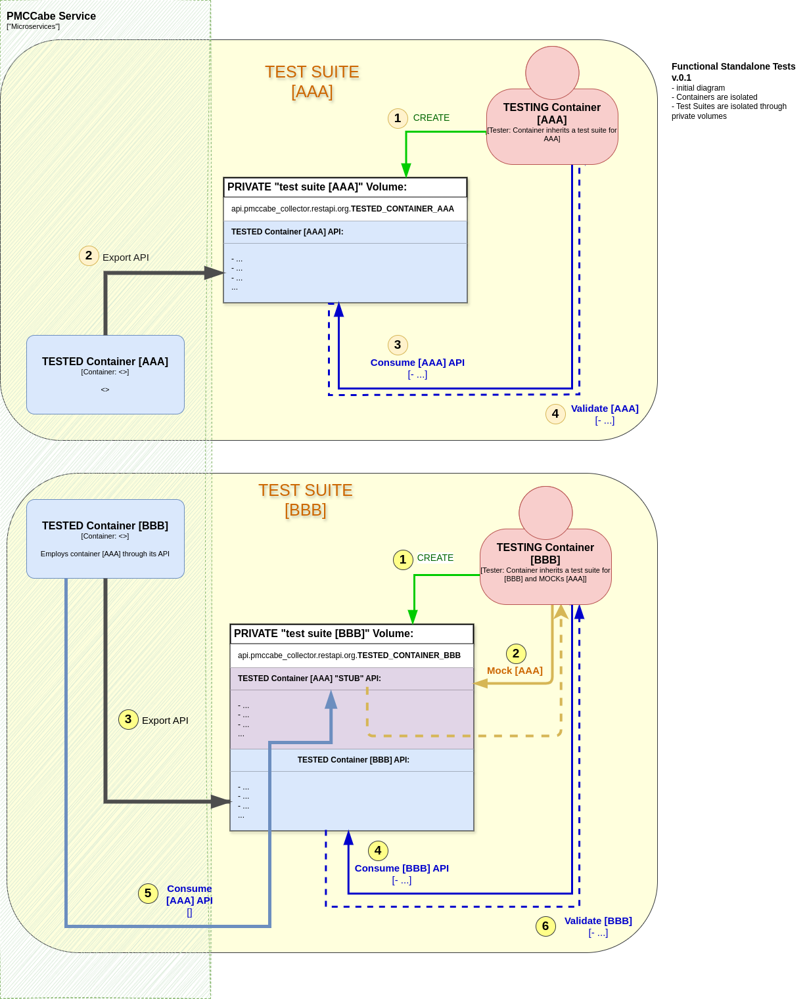

## To build & to Test all images together

### Launch functional tests

Stop service by shutting all containers down and execute the command:

`docker compose -f compose-functional.test.yaml up --abort-on-container-exit`

The testing flow uses multiple microservice container parallel execution. All containers are placed into isolated testing environments. By virtue of container isolation, it allow us to carries out all container tests scenarious simultaneously, which improves tests execution througput significantly as well as emphasizes more bugs by changing scheduling container launhing and execution policy.
Actor which trigger testing scenarions are represented by another container which encapsulate required stubs and mocks all necessary setup. Additional services are used here: `syslon-ng` and `log-aggregator`.

This testing flow can be represented on the following picture:
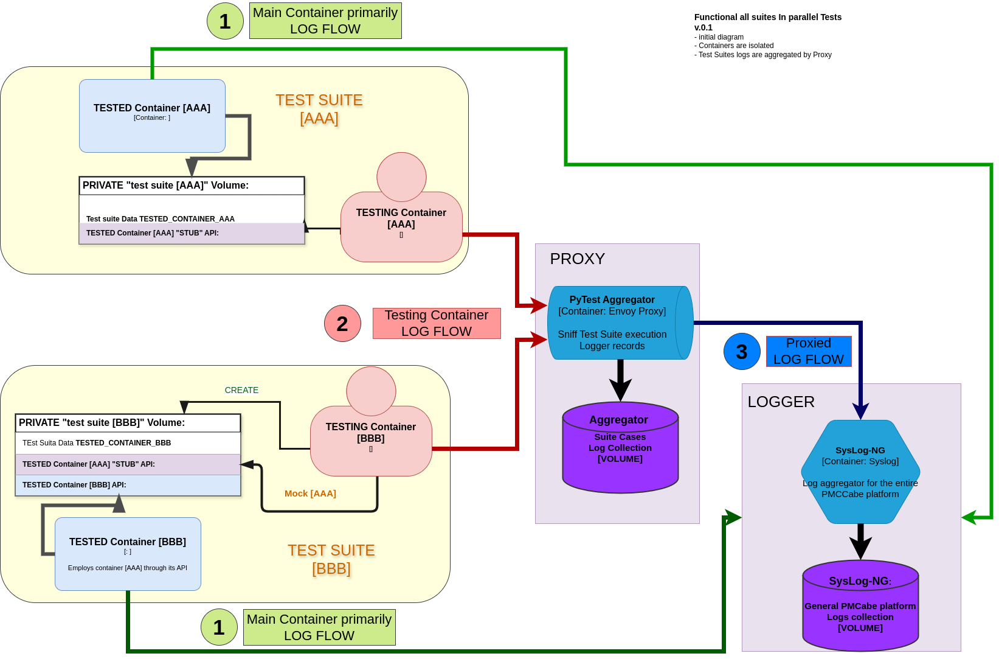

### Launch integrational tests (Simian Army?):

Simian army is delayed... An integration test scope came instead!

Launch `Analysis UC` or `Analytic UC` by exeting the following command:

`docker compose -f compose-analysis.yaml up -d`

or

`docker compose -f compose-analytic.yaml up -d`

At anytime afther that invoke the command to launch the integrational test scope:

`docker compose -f compose-analysis.integrational-test.yaml up --abort-on-container-exit`

This testing flow of this integrational scop can be represented on the following picture:
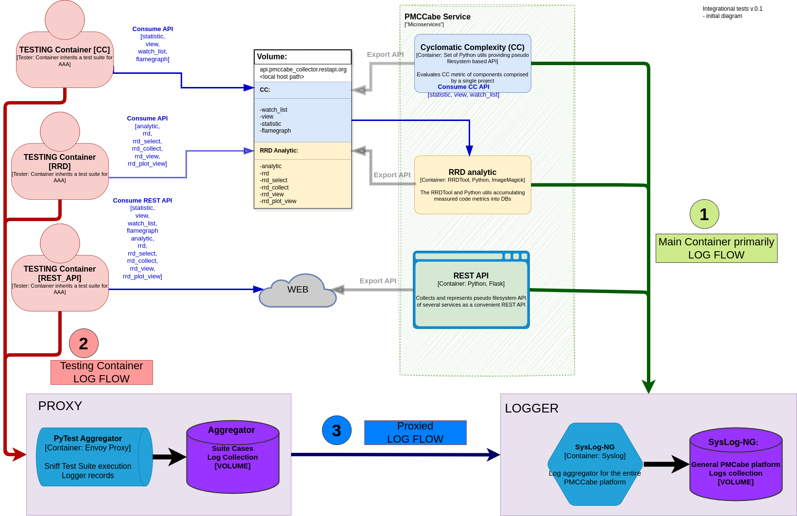
