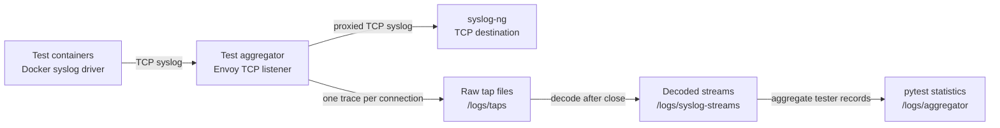

# Test Aggregator Functional Description

## Purpose

The test aggregator observes Docker syslog traffic produced by functional-test
containers, preserves each TCP connection as an Envoy tap trace, reconstructs
the syslog records for each connection, and calculates pytest totals per test
container.

The aggregator is an inline TCP proxy. Test traffic is still delivered to
syslog-ng while Envoy captures a copy for later analysis. The aggregator does
not mount or read syslog-ng's filesystem.

## Data flow



## Components

| Component | Responsibility |
| --- | --- |
| `bootstrap.sh` | Initializes storage, waits for syslog-ng, starts the watcher and Envoy, coordinates capture shutdown, and reports the final result. |
| `envoy.yaml` | Defines the TCP listener, downstream tap transport socket, and TCP proxy to syslog-ng. |
| `tap_watcher_service.sh` | Tracks tap-file creation and closure, polls Envoy's downstream RX-byte counter for global inactivity, starts per-file decoders, and invokes aggregation. |
| `decode_envoy_tap.py` | Parses one completed length-delimited Envoy protobuf tap with `xds-protos`, reassembles downstream TCP bytes, frames syslog records, and writes one reconstructed connection log. |
| `log_watcher_service.sh` | Runs the existing Python statistics aggregator and stores its exit status. |
| `log_aggregator.py` | Selects tester records, groups them by container tag, parses pytest summaries, validates totals, and determines success or failure. |

## Startup and readiness

1. `bootstrap.sh` removes data left by an earlier run and creates:
   `/logs/taps`, `/logs/syslog-streams`, and `/logs/aggregator`.
2. The runtime volume hides permissions created in the image layer. Bootstrap
   therefore assigns `/logs/taps` to `envoy:envoy` with mode `0750`.
   Envoy writes raw traces; the root-owned watcher writes decoded and result
   files.
3. Stored SSH host keys are removed because service identities can change in
   the virtual network.
4. Bootstrap waits for the syslog-ng SSH endpoint and runs the remote
   syslog-ng health check.
5. Admin, listener-port, and downstream-host placeholders in
   `/etc/envoy/envoy.yaml` are replaced from environment variables.
6. The tap watcher starts before Envoy. Bootstrap waits up to 10 seconds for
   `/logs/aggregator/watcher_ready`, which is created only after
   `inotifywait` has installed its filesystem watch.
7. Envoy starts and the container health check sends a small TCP logger message
   through its listener. Test services can use the aggregator's healthy state
   as a Compose dependency.

## Traffic capture

Envoy listens on `UPSTREAM_AGGREGATOR_TCP_PORT` and proxies every accepted TCP
connection to `DOWNSTREAM_SYSLOG_HOSTNAME:DOWNSTREAM_SYSLOG_TCP_PORT`.
A loopback-only admin listener exposes the TCP proxy byte counters to the
watcher on `ENVOY_ADMIN_PORT`; it is not published outside the container.

The downstream tap transport socket uses:

- `any_match: true` to capture every connection;
- streamed `PROTO_BINARY_LENGTH_DELIMITED` output, with every socket event
  submitted as its own segment by the pinned Envoy build;
- one file per connection under
  `/logs/taps/connection_<envoy-connection-id>.pb`;
- a configurable per-read capture limit controlled by `MAX_BUFFERED_RX_BYTES`,
  defaulting to the protobuf `uint32` maximum (`4294967295`) so a streamed read
  cannot be shortened by the TAP limit.

The raw connection ID is retained for correlation with Envoy diagnostics and
to prevent collisions when one container reconnects.

## Deciding when capture is complete

`WAIT_MSEC_UNTIL_FINISH` is a global traffic-inactivity period, not a maximum
test duration. Once per second, the watcher polls Envoy's monotonic
`tcp.destination.downstream_cx_rx_bytes_total` counter. Every increase resets
the inactivity clock. With the default value of `15000`, capture stops only
after Envoy has received no downstream bytes for 15 seconds.

The byte counter is used instead of tap-file `MODIFY` events because Envoy
buffers file-per-tap output. A heartbeat can therefore reach Envoy before its
protobuf representation becomes visible as a filesystem write.

Docker logger TCP connections can remain open after pytest finishes.
Consequently, the watcher does not require connections to close before the
inactivity period expires. Instead:

1. The watcher creates
   `/logs/aggregator/capture_stop_requested`.
2. Bootstrap recognizes the marker and sends SIGTERM to Envoy.
3. Envoy stops accepting traffic and closes its tap files.
4. `CLOSE_WRITE` events allow the watcher to decode only immutable files.
5. The watcher allows 30 seconds for all active tap files to close.

`MAX_WAIT_MSEC_UNTIL_FINISH`, defaulting to `900000` (15 minutes), is the
hard safety limit for the complete capture phase. Reaching it produces an
infrastructure failure.

This design avoids analyzing a partial TCP stream while also supporting
long-lived Docker logging connections.

## Per-connection decoding and naming

Each `CLOSE_WRITE` event starts an independent
`decode_envoy_tap.py` process. Decoders may run concurrently.

The decoder:

1. Reads each protobuf varint length prefix and parses the corresponding
   `envoy.data.tap.v3.TraceWrapper` with the generated classes supplied by
   `xds-protos`.
2. Extracts only downstream socket `read` events. These are bytes sent by the
   logging container to the aggregator.
3. Validates that streamed files contain a single trace ID and a connection-close
   event, then concatenates read bodies in emitted order to reconstruct the TCP
   byte stream. Buffered traces remain supported for existing diagnostics.
4. Rejects a body marked `truncated`; incomplete evidence must not be used to
   calculate test totals. The error reports the effective
   `max_buffered_rx_bytes` value and recommends increasing
   `MAX_BUFFERED_RX_BYTES` in the Docker Compose configuration.
5. Finds RFC3164-like Docker syslog headers and splits the reconstructed stream
   at complete record boundaries.
6. Supports both formats used by Docker/syslog deployments:

   ```text
   <PRI>Mon DD HH:MM:SS producer[pid]: message
   <PRI>Mon DD HH:MM:SS hostname producer[pid]: message
   ```

7. Ignores the RFC5424 octet-counted connection created by the container health
   check when it contains no tester data.
8. Verifies that a connection contains at most one syslog producer.
9. Sanitizes the producer tag and atomically publishes the reconstructed log.

Raw files keep their Envoy names. Decoded files include the Docker syslog tag
configured by `tag: "{{.Name}}"` and the connection ID:

```text
/logs/taps/connection_18.pb
/logs/syslog-streams/code-metric-platform-rrd-functional-tester-1__connection_18.log
```

If no recognizable syslog record exists, such as for the health-check
connection, the decoded file keeps its generic connection name and is empty.

## Test-result aggregation

After every decoder exits, the watcher checks their statuses. If any trace
cannot be decoded, aggregation is skipped and the overall result is failure.
Decoder errors are preserved as
`/logs/aggregator/connection_<id>.pb.decode_stderr`.

When all traces decode successfully, `log_watcher_service.sh` runs
`log_aggregator.py` against the immutable reconstructed directory. Although
the parser mode is named `pcap`, at this stage it reads reconstructed syslog
text and removes the leading `<PRI>` field.

The aggregator selects records whose syslog producer contains `tester` and
groups them by producer/container name. It recognizes pytest records shaped
like:

```text
collected 4 items
================ 4 passed in 0.02s ================
================ 1 skipped in 0.01s ===============
================ 1 failed, 3 passed in 1.20s =======
```

For each test container it calculates:

- total collected;
- passed;
- skipped;
- failed.

The aggregate is invalid if:

- any failed count is nonzero;
- `total != passed + skipped + failed` for any container;
- no tests were collected or no tests passed.

Skipped tests are reported to stderr but do not by themselves fail the run.
When all checks pass, stdout contains `All tests PASSED: (passed/total)`.

## Result files and exit behavior

| Path | Content |
| --- | --- |
| `/logs/taps/` | Raw streamed length-delimited Envoy protobuf taps, one file per TCP connection. |
| `/logs/syslog-streams/` | Reconstructed, newline-delimited syslog records, normally named by producer and connection ID. |
| `/logs/aggregator/result_log_stdout` | Per-container statistics and the success recap. |
| `/logs/aggregator/result_log_stderr` | Skips, failed/inconsistent statistics, watcher failures, or decoder failures. |
| `/logs/aggregator/result` | Numeric process result written by the watcher. |

## GitHub Actions artifacts

Jobs that run `test_aggregator` execute the local
`.github/actions/upload-test-aggregator-artifacts` action with `always()`, so
diagnostics are retained for successful and failed jobs. The artifact is named
`<job-name>-envoy-taps-<run-attempt>` and is available from the workflow run's
**Artifacts** section for 14 days.

It can also be downloaded with the GitHub CLI:

```bash
gh run download <run-id> \
  --name <job-name>-envoy-taps-<run-attempt> \
  --dir test-aggregator-artifacts
```

The action copies the stopped or running aggregator container's complete
`/logs` volume. An extracted artifact therefore contains the original protobuf
files under `taps/`, reconstructed records under `syslog-streams/`, aggregation
results under `aggregator/`, the resolved Compose configuration, container
inspection data, and GitHub run metadata. Raw traces can be decoded after
installing the image's pinned `xds-protos` version:

```bash
python3 common/images/test_aggregator_image/decode_envoy_tap.py \
  test-aggregator-artifacts/taps/connection_<id>.pb \
  connection_<id>.log --name-by-producer
```

Success is `0`. Python's `-1` failure result appears to the shell and Docker
as `255`; watcher and decoding infrastructure failures also use `255`.

On failure or termination, bootstrap prints the reconstructed logs and the
aggregation/decoding errors to container output.

After the watcher has produced a result and Envoy has stopped, bootstrap exits
with the stored result code. The aggregator container therefore terminates
automatically on success, test failure, or infrastructure failure.

## Configuration

| Variable | Default | Meaning |
| --- | ---: | --- |
| `WAIT_MSEC_UNTIL_FINISH` | `15000` | Required interval with no downstream bytes before capture shutdown. |
| `MAX_WAIT_MSEC_UNTIL_FINISH` | `900000` | Hard limit for the capture phase. |
| `ENVOY_ADMIN_PORT` | `9901` | Loopback-only Envoy admin port used to read the downstream RX-byte counter. |
| `MAX_BUFFERED_RX_BYTES` | `4294967295` | Per-read streamed TAP capture limit; defaults to the protobuf `uint32` maximum to prevent limit-based truncation. |
| `UPSTREAM_AGGREGATOR_TCP_PORT` | `13601` | Envoy listener port receiving Docker syslog traffic. |
| `HOST_UPSTREAM_AGGREGATOR_TCP_PORT` | `13601` | Host-published TCP port. |
| `DOWNSTREAM_SYSLOG_HOSTNAME` | `syslog-ng` | Compose-network DNS name of the downstream syslog service. |
| `DOWNSTREAM_SYSLOG_TCP_PORT` | `6601` | Downstream syslog-ng TCP port. |
| `DOWNSTREAM_SSH_SECRET` | `syslog-ng` | Secret used by the bootstrap SSH readiness functions. |

## Functional assumptions and limitations

- All relevant logging traffic must pass through the Envoy listener.
- The inactivity interval must exceed legitimate gaps in downstream traffic.
  Long-running tests must send heartbeats more frequently than this interval;
  otherwise capture can stop before a test finishes.
- Each Docker logger TCP connection is expected to represent one syslog
  producer.
- Test summaries must use one of the pytest formats currently recognized by
  `log_aggregator.py`. Other combinations or output formats require an
  additional statistic parser.
- The protobuf length delimiter is decoded locally; the `TraceWrapper` schema
  and all tap fields are parsed by the generated bindings from `xds-protos`.
- A trace marked truncated is treated as an infrastructure error rather than
  producing potentially incorrect statistics.
- Operators can lower `MAX_BUFFERED_RX_BYTES`, but a read larger than the
  configured value is marked truncated and fails decoding. The default is the
  largest value accepted by Envoy's `UInt32Value`; resource exhaustion, disk
  errors, or premature process termination remain possible and are not TAP
  truncation.
